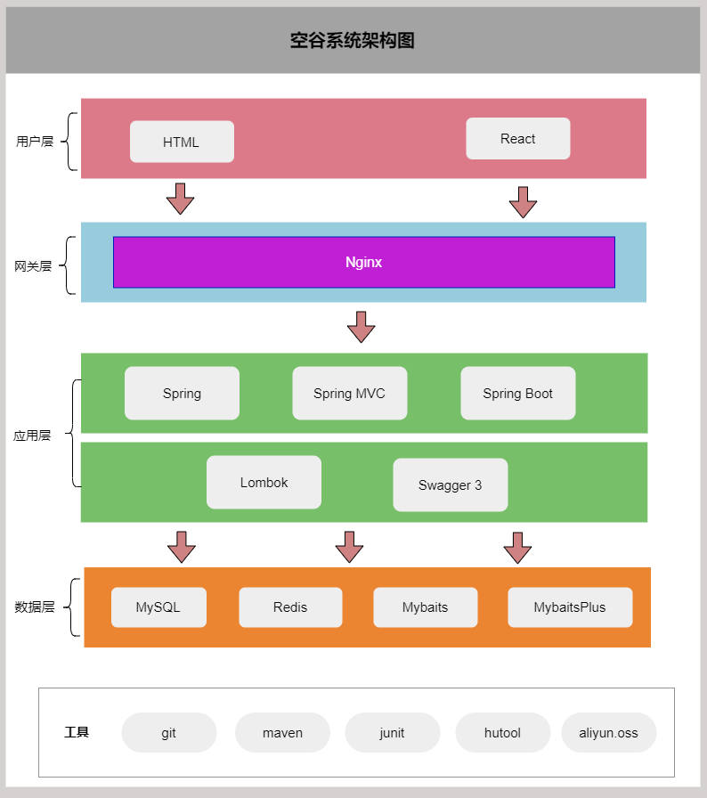
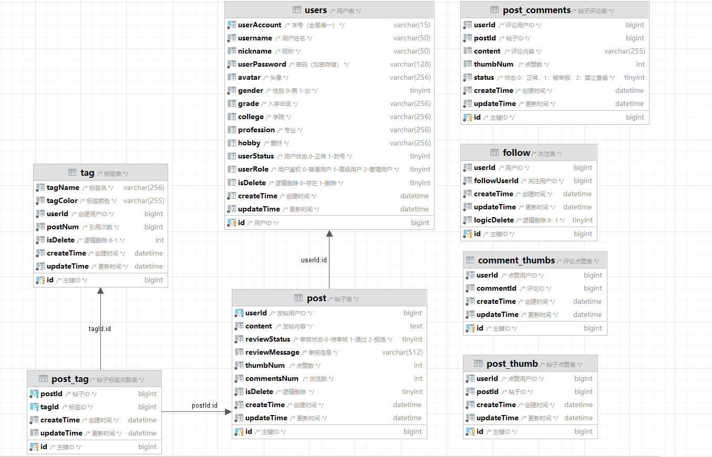

   KONGGU-空谷校园论坛系统

## 项目介绍
空谷（KONGGU），一个前后端分离的校园论坛系统，前端使用**Ant Design Pro + React + umi** 快速搭建，后端使用 **SpringBoot + Mybatis-plus** 开发、搭配 **Redis** 缓存用户信息提高用户登录态的稳定性和可靠性、结合**阿里云SDK**完成图片上传。本项目使用Apache License Version 2.0开源协议。

## 项目背景
受到北大校园的未名BBS启发，认为学校可以开发一个校园内部论坛平台。每位学生可以根据不同的板块进行动态分享校园生活，交友，求助或二手交易等内容进行意见交流。论坛内可以对校园日常进行交流和分享，更加快捷、可信的得到校园内的讯息，促进新老学生的交互。同时学校管理员可对帖子动态、用户管理，进行**CRUD**操作，后期可以扩展连接校园网系统，进行课程与生活的结合，部分重要信息可以在论坛通过公告发布。

## 核心功能

1. 用户注册和登录：用户可以通过注册账号并登录使用该网站。
2. 标签匹配：用户可以选择自己的技能和需求标签，系统会根据标签匹配合适的队友。
3. 热点推荐：系统会根据点赞、标签热度进行相关帖子的优先推送。
4. 帖文发布、点赞和关注：用户可以发布自己的帖文，其他用户可以对其进行点赞、关注和评论，促进交流。
5. 用户管理：管理员可以对用户进行管理，包括审核用户信息和处理用户投诉等。

## 项目亮点

1. 在脚手架自带的 umi-request 请求库基础上进行改造和封装，添加全局请求拦截和全局异常处理逻辑、自动根据项目启动命令来区分环境，减少重复代码、提升项目可维护性。
2. 选用 MyBatis + MyBatis-Plus 进行数据访层开发，复用大多数通用方法，并且通过继承定制了自己的**通用操作模板**，大幅提升了项目开发效率
3. 为了明确接口的返回，自定义统一的错误码，并封装了**全局异常处理器**，从而规范了异常返回、屏蔽了项目冗余的报错细节 
4. 对于项目中的 JSON 格式化外理对象，采用 **双检锁单例模式** 进行管理，从而复用对象，避免了重复创建对象的开销，便于集中维护管理。
5. 使用 **Redis** 存储用户登录态，相比单纯使用 Session 存储保证了用户登录态的可靠性和稳定性，提高处理性能。 
6. **优化存储空间**使用String代替Hash来存储用户信息，节约了44.1%的内存。 
7. 使用 **AOP** 编程的思想对用户权限进行统一管理，优化用户权限验证模块的代码； 
8. 通过 **HandlerInterceptor** 优化获取用户登录态模块，保存到本地线程降低了代码耦合。

## 技术选型

### 前端

| 技术及版本        | 作用             | 原因                     |
| ----------------- | ---------------- | ------------------------ |
| React             | 前端主要开发框架 | 前端主流开发框架之一     |
| Umi               | 前端辅助开发框架 | 对React的进一步封装      |
| Ant Design 组件库 | 前端开发组件     | 便于快速开发前端的组件库 |

### 后端

| 技术及版本        | 作用                       | 原因                        |
| ----------------- | -------------------------- | --------------------------- |
| Spring Boot 2.7.x | 主要开发框架               | Java主流开发框架            |
| Lombok            | 注解式代码生成             | 节省开发时间                |
| Mybatis           | Java操作数据库的持久层框架 | 对 JDBC 的封装              |
| MyBatis-Plus      | 对 mybatis 的增强          | 不用写 SQL 也能实现增删改查 |
| MySQL 数据库      | 存储关系型数据             | 主流的关系型数据库          |

### 部署

| 技术及版本 | 作用               | 原因         |
| ---------- | ------------------ | ------------ |
| Nginx      | 部署前端、反向代理 | 轻量、性能高 |

### 软件架构

### 数据库架构

## 功能介绍

### 用户注册

1）用户未登录时点击个人页将跳转至登录页。

2）根据每个人的姓名+学号进行唯一注册，根据校园系统的学生名单进行校验

3）注册成功后姓名和学号就无法修改，用户可选择修改密码。

### 校园广场

1）注册成功后或登陆后可以进入校园广场，用户可点击查看当前热门帖子及相关标签。

2）也可以点击对应的用户进行关注。

### 个人主页

1）注册成功后或登陆后可以进入个人页，用户可点击修改信息修改除登录账号外的信息。

2）我的关注：用户创建的队伍信息。

3）我的粉丝：用户加入的队伍信息。

4）我写的帖文：用户创建的帖文信息。

5）联系客服：用户遇到问题可联系客服。

### 修改信息

1）头像修改：用户点击后可上传喜欢的头像。

2）昵称修改：用户可修改展示的昵称。

3）个性签名：用户可以简略地描述自己。。

4）个性签名：用户可以简略地描述自己。

### 搜索用户

1）标签搜索：用户可以点击右上角的搜索按钮，通过标签搜索用户。

### 用户详情

1）用户详情：用户点击任意其他用户后可跳转至用户详情页。

### 帖子

1）用户可以点击导航栏的加号新建帖子。

2）新帖子将显示在热门帖文中。

3）点击博文将进入帖子详情页。

4）用户可以关注其他用户。

5）更多操作：点击右上角可显示弹框。复制链接可将博文链接复制。

6）点赞帖子：用户可以点击右下角点赞帖子。

### 评论

1）博文评论：用户可以在博文下评论。

2）点赞评论：用户可以点赞评论。

3）删除评论：评论作者和管理员可以删除评论。

### 管理员

1）管理员可以根据举报信息审核帖子，对帖子进行封禁操作。

2）管理员可以根据举报信息设置评论是否允许查看。

3）管理员可以根据学生情况对账户进行封禁解封。
